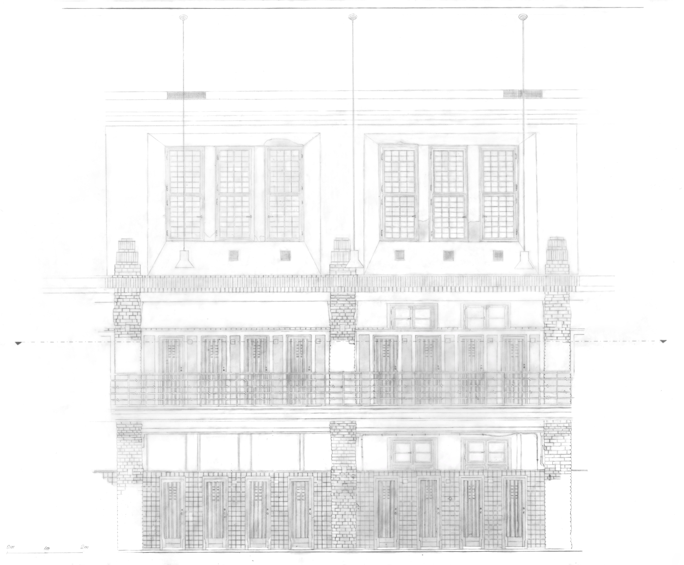

## Чего ждать от обучения?

Всем любителям архитекторы, привет! Начнём с ожиданий от курса. В первую очередь не стоит недооценивать разницу архитекторы Bachelor of Arts и Bachelor of Science. В первом семестре у вас будет 3 творческих модуля, на втором 2, на третьем и последующих 1. В стенах данного университета вы будете изучать половину всего того, что проходят на курсе Bauingenieurwesen, да, сокращенную программу, но все же не стоит ждать постоянных порывов творчества, изобразительного искусства или академического рисунка. 

Также не советую слушать поступивших в одно с вами время первокурсников на других курсах, обучение архитектуре отличается от стандартного варианта обучения в TU Berlin. У многих из вас будет общее расписание, у вас будет своя группа по некоторым предметам, будет возможность легко заобщаться с окружающими, и вы будете находиться постоянно в одном здании Architecturgebäude (A), а не ходить между корпусами. 

Готовьтесь изучать необходимые программы самостоятельно до начала учебе, это очень вам поможет. 

## Необходимые программы именно для обучения в TU Berlin 

- **Rhino 3D**: загружаете либо студенческую платную версию на одного, либо покупаете групповую лицензию в кооперации с вашими однокурсниками, но лучше не пожалеть денег и начать изучать до поступления, позже будет пояснение почему 

- **ArchiCAD как BIM software**: есть бесплатная версия для студентов, где постоянно придется удалять надпись 'Bildungs Version' на всех PDF с вашими чертежами, обучение и сдачи ведутся на нем, а не в Revit 

- **V-Ray Render**: устанавливается как плагин к Rhino 3D, самая сложная прога в изучении с 0 из всех. После первого курса можно пользоваться любыми другими (более легкими) программами для рендера, но для первого курса нужен именно он.

- **Photoshop/Affinity Photo**: или что-то схожее, где вы сможете быстро редактировать фотографии, многое можно быстро сделать и в программах на телефоне, картинка ниже

## Параметры ноутбука/компьютера

Я не большой профессионал в компьютерах, поэтому скажу только о параметрах, касающихся учебы на архитектуре. 

- Мощный процессор обязательно 

- Хорошая видеокарта для  рендера (визуализации 3D модели) обязательно. Просто посмотрите видео о ноутбуках именно для архитекторов и обратите внимание на их видеокарту. Также можно заходить на сайты программ для рендера (5D render, Twinmotion и тд) и смотреть, какие условия у них для видеокарты, чтобы можно было пользоваться всеми функциями программы 

- Хорошая цветопередача и расширение (лучше брать выше HD) 

- WINDOWS, примите и простите это как факт, потому что замучаетесь с некоторыми некорректными отображениями программ на MAC, да и у туторов всех винда, то есть подсказать лучше они помогут именно с ней.

- Никакие сенсерные экраны, графические планшеты вам пока будут не нужны, лучше вложитесь в видюху. То же самое касается и выбора размера ноута, лучше 13' с крутой видеокартой, чем 16' с более плохой. Доп. монитор вы всегда сможете купить (хотя вряд ли он вам понадобится).

## Поступление

Всего есть два семестра, зимний и летний. Зимний начинается с 1 октября и заканчивается 31 марта, летний идет с 1 апреля по 30ое сентября. В семестры входят зимние каникулы, само учебное время и экзаменационное время без лекций два раза в год. На других факультетах бывает такое, что можно поступить как на зимний, так так и на летний семестр, но на архитектуру можно поступить только один раз в год, только на зимний семестр. То есть вы увидите всех своих однокурсников сразу же в один день. И это будет примерно 10ое октября. Не смотря на то, что семестр официально начинается раньше, первое вводное мероприятие будет в 10ый числах, а первые лекции с 17 октября. Обо всех этих новостях можно узнать в [instagram TU Berlin](https://www.instagram.com/tu_berlin), [Architektur Fachgebiet](https://www.instagram.com/institutfuerarchitektur), [IfA Kollektiv](https://www.instagram.com/ifakollektiv) и на сайте [TU Berlin](https://tu.berlin).

На все онлайн вводные мероприятия ходить вообще не обязательно, вся эта информация будет повторяться вживую. А вот на первое живое мероприятие в архитектурном корпусе для нашего факультета обязательно идите, оно будет в аудитории А151. Во-первых там будут представляться все профессора, во-вторых, будет более понятно расписание, в-третьих первые знакомства вам очень помогут. Раньше этого первого мероприятия вам ничего организационного делать не нужно, вы ничего не пропустите.

Записывайте или фоткайте всю презентацию для первокурсников на вводном мероприятии 10ых чисел. Эта информация очень понадобится, пока вы не зарегистрировались на все предметы на ISIS и MOSES (о них в [блоге подробно рассказал Денис](https://tuberlin.ru/posts/guide/)) и не знаете, когда будут первые лекции. На презентации будет стоять вся информация от кабинета до времени. 

В Arch. здании на первом этаже есть кафе "А", это тусо-место, где все архитектурные собираются. Там и вы с первокурстниками соберетесь, когда будет пауза на первом мероприятии. Заводите разговор со всеми, кому не лень. Пытайтесь понять, чем занимался человек до поступления, был ли он связан со строительством, делал ли Ausbildung. Это потом будет решающим фактором в формировании групп для работы. А твоя группа - это основа твоей оценки по главному предмету. Большинство на 1ом и 2ом семестрах не способны продуктивно работать, могут подводить и вообще не понимать, что требуется по заданию, у всех будет фаза адаптации. Но все оценки первого года обучения очень важны для поступления на магистратуру. Ваша задача - минимизировать ущерб с первых встреч. Все будут распределяться в первые группы по знакомствам, что очевидно, поэтому и знакомимся) Ну а так, скорее всего вы встретите классный интересный открытых ребят, вне зависимости от их способностей в архитектуре. Люди у нас очень интересные учатся) 

## План обучения

У каждого факультета TU Berlin есть свой план обучения на минимальный срок в 6 семестров Bachelor, собранный в PDF. У будущих архитекторов это план обучения 2018 года. Там есть расписание (которое я здесь также прекрепила) и другие особенности курса. Их читать не обязательно, но в течение учебы вы будете иногда обращаться к этому документу.

По поводу растягивания на более долгий срок обучения. Всем известно, что можно закончить не за 3, а за 4-5 лет бакалавр, но тут есть нюансы, чтобы не попасть в еще больший стресс. Без базы некоторых предметов учащийся не сможет пойти на другой предмет, так как тот будет либо продолжением первого, либо требовать знания из первого. Например из первого семестра можно спокойно 'выкинуть' только исторический модуль и искусство. Из второго семестра также только исторический и социологический модуль. А вот в 3его семестре уже больше возможностей. Помните, что почти все предметы идут раз в год, а не раз в семестр.

**Понятие "Модуль"**

В основном расписании указаны только модули. Модуль не равно предмет. В один модуль может входить несколько активностей, например: лекция по строительной физике раз в денелю, лекция  по материаловедению раз в неделю и занятия с туторами на тренировку задач. И это все один модуль. 

Закрыть модуль можно только сдачей экзаменов, всем все равно на посещение лекций, вы можете ни разу на них не быть, и учить только экзаменационный материал, просто это не всегда возможно. Это работает со всеми модулями, кроме Entwerfen und Baukonstruktion, там важно и присутствие и все промежуточные сдачи проекта.

Даты записи на экзы очень важны, их нельзя пропускать, их говорят преподаватели на первых лекциях и они прописаны на MOSES. 



<h1 style="font-size:24px;">Важно!</h1>

- **Средний балл** для поступления после немецкой школы в 2022: 1,5 - то есть достаточно высокий. В 2021 был 1,6, в 2020 был 1,7. То есть в будущем в теории может стать еще выше 

- **Уметь рисовать не нужно** как для поступления, так и для обучения, даже на предмете Bildende Kunst (пояснение ниже). Но нужны минимальные навыки и понимание, как быстро нарисовать несколько кубов, поставленных друг на друга в перспективе. Это нужно, чтобы быстро на бумаге в виде скетча визуализировать свои идеи, что часто требуется.

- **Учите программы!!** Даже те, которых нет в моем списке обязательных, это вам поможет концентрироваться не на техническом выполнении задания, а на концерте, что обеспечит вам гораздо более творческий подход к обучению.

- **Найдите себе хороших людей** во все группы по проектам, чтобы на них можно было положиться, даже если они чего-то не умеют, т.к. такие все равно научатся. Человек, который офигенно знает ArchiCAD, но свалит на курсы по вождению за день до сдачи проекта или проспит что-то важное - гораздо хуже. Оценка у группы всегда одна на всех.

- **Совет тем, кто хочет попробовать закончить за 3 года, сама так пытаюсь:** будут лекции, которые станут пустой тратой времени,  о них расскажу ниже. Лучше вместо них сконцентрироваться на основном проекте. Будьте готовы иногда спать по 4-5 часов целую неделю, чтобы все успеть сделать хорошо и вовремя. 

- **Строительная практика:** до конца бакалавриата вам нужно успеть пройти обязательную 2х месячную практику. Только с пройденной практикой у вас будет допуск к написанию бакалаврской работы. В течении 2х месяцев вы должны будете по 40ч в неделю работать на строительную или ремонтную фирму бесплатно, как практикант, чтобы вам в конце дали сертификат о пройденной практике, и вы смогли предоставить ее в секретариат вуза. Секретариат вышлет вам на Email подтверждающий документ о том, что вы прошли практику. Практику нужно проходить в каникулы, специально отведенного времени под нее нет. И фирму строительную/ремонтную нужно искать самостоятельно. Но из плюсов: можно пройти ее заграницей, то есть в России, Белоруси, Украине и т.д., главное документ от фирмы перевести на немецкий. Вся информация по практике [тут](https://www.google.com/url?sa=t&source=web&rct=j&opi=89978449&url=https://www.static.tu.berlin/fileadmin/www/40000062/Dokumente_Formulare/Arch_B_Praktikumsrichtlinie_2019.pdf&ved=2ahUKEwiOx6nbhKeEAxUvXvEDHd1bDdgQFnoECBQQAQ&usg=AOvVaw3g4CiDT_NFGYb__e-B0HIV).

- **Группы в соц. сетях:** заходите во все WhatsApp группы, которые будут образовываться на первом вводном мероприятии. Также вот пара общих ссылок на инстаграм [ТУ Берлина](https://www.instagram.com/tu_berlin?igsh=azJwcnphZnF5NHBi) и [Institut für Architektur](https://www.instagram.com/institutfuerarchitektur?igsh=MXBpNWdwcTlwam0wMA==).


<h1 style="font-size:24px;"></h1>

## 1 cеместр

### Entwerfen und Baukonstruktion I

**Описание:** Идет два дня в неделю с 9-10:00 до вечера, обычно это четверг и пятница. Это самый важный модуль, собственно это видно по количеству LP, которое за него дается, а именно 12. Смысл модуля в том, чтобы на практике показать, как проектируются здания через постройку моделей и чертежей. Модуль состоит из туториумов (проще говоря, мастер-классов), недлинных лекций и процесса проектирования под руководством профессора, WiMi (Wissenschaftliche Mitarbeiter, то есть научных сотрудников) и туторов. В конце каждого такого модуля у вас будет один проект на группу из 3-4 человек. Этот модуль будет во всех ваших 6ти семестрах, то есть по итогу Bachelor у вас в идеале должно быть 6 проектов включая Bachelorarbeit для портфолио. 

Чтобы сдать предмет, нужно быть на всех промежуточных презентациях и создать и представить итоговый проект (модель + чертежи)

**Сложности:** У всех людей, которые вас будут вести в течение проекта может не совпадать мнение по многим вопросам проекта. Это нормально, но вы должны уточнить, кто из WiMi будет оценивать вашу работу, и учитывать больше всего его мнение и мнение профессора. Туторы никогда не ставят оценки, это просто успешные ученики со старшего семестра или магистратуры. 

Сдать этот модуль на 1,0 можно очень в редких случаях, даже если критика по вашему проекту достаточно хорошая. 

Вам понадобится значительно больше времени для создания моделей и чертежей, чем 2 дня в неделю. Иногда я ночевала в университете, чтобы все успеть.

В каждом семестре можно выбрать одну из предлагаемых студий, так как все ученики одного потока не влезают в одну студию (студией сокращенно называется этот модуль, поскольку все проектирование проходит в студиях университета). Студий бывает от 2 до 4 обычно, они меняются от года к году, ниже я прикреплю информацию о моей студии 1ого семестра.

Вас не будут обучать программам и тому, как делать коллажи, нужные графики и т.д. Максимум на что вы можете рассчитывать: 30-минутный мастер-класс от туторов, что да как. Но этих знаний никогда не хватает. Но вся информация всегда есть в YouTube. 

**Советы и доп. материалы:** В 1ом семестре скорее всего вам все придется чертить от руки, но знание программ вам в этом тоже поможет. А именно ArchiCAD  и Rhino 3D. То есть сделали быстро 3D модель проекта, перекинули через функцию в Rhino "MAKE 2D" в ArchiCAD, распечатали и перевели с помощью Lightboard (доски с подсветкой, чтобы переводить рисунки) на бумагу. Готово. Гораздо более удобно, чем чертить от руки и беситься. Тем более, что много стирать на чертежах нельзя, иначе будет грязный результат. 

Lightboard дешевле всего купить в Action, дороже можно на Amazon.

Уточняйте у WiMi все непонятные для вас нюансы концепта проекта, а не у туторов. Туторы могут помочь с программами, с мелочами представления итоговых чертежей, но вопросы о смысле самого проекта лучше уточнять у WiMi.

Купите обязательно нормальные качественные карандаши от H6 до B6. Они вам пригодятся и в 3ем семестре. Также купите механические карандаши тоже от H6 до B6 и хороший Fineliner. Все остальное по мере необходимости. 

Рядом с Arch. Gebäude есть Boesner - магазин для художников. Там куча всего для моделей и чертежей.

Информация и примеры заданий моей студии [тут](https://www.instagram.com/fgdeco?igsh=MTlhczNveTA3a2s3Ng==) и [тут](https://fgdeco.de/?fbclid=PAAaZYU5Xq-0FlWuRG2U1WVr4YwzdmGoKUS0ovKdpG17qpijGfmBxZ2lpRk1Q).

Примеры заданий моего 1ого семестра в моей студии тогда [тут](https://fgdeco.de/category/hello-architecture-vol4/).

### Tragwerkslehre I + II

**Описание:** Грубо говоря, это предмет о том, как распределить нагрузку на конструкцию, чтобы она не сломалась, в русском языке +/- верным аналогом будет сопротивление материалов (стали, дерева и т.д.). Модуль достаточно сложный и состоит из 3х активностей: две лекции в неделю и туториумы. 

Курс идет год, чтобы быть допущеным к экзамену, нужно сдать 12 домашних заданий, на каждое из которых дается 10 дней на выполнение. ДЗ не оценивается, нужно просто набрать на каждом 50%. Тутории - это занятия с туторами (это ребята с магистратуры), которые помогают решать эти самые домашние задания и дают еще дополнительную информацию. Туториумы будут несколько раз в неделю. Можно приходить хоть на все, главное записаться хотя бы на один на ISIS. В конце 2ого семестра будет письменный экзамен, который длится 4 часа. 

**Сложности:** Домашние задания сложнее того материала, который дается на лекциях. На их решение нужно прямо много времени. Обязательно ходите на туториумы, чтобы не только послушать туторов, но и с другими ребятами решать дз и заводить друзей, которые лучше вас понимают в решении.

**Советы и доп. материалы:** Списать дз можно было в прошлом году у старших курсов, так как они повторялись. Но в этом году задания были изменены. Но вы все еще можете на примере старых заданий попробовать решать ДЗ, они все решаются по подобию достаточно хорошо. Но если у вас нет базы школьной физики (механики), то лучше за полгода до экзамена найти репетитора из старших курсов.

Это не тот экзамен, который можно сдать, не готовясь. Прорешайте старые клаузуры, они есть у туторов. Это очень сильно поможет. Задания иногда повторяются, за исключением последних. Последних сложных заданий с созданием своей конструкции больше нет в клузурах, они были только до 2018 года. 

Даже если вы понимаете, что не сдадите экзамен, любым способом сдайте все 12 дз. Так как несдача 1ого из них заставит вас повторно сдавать в следующем году все 12, а это будет кошмар. Хоть списывайте, хоть решайте днями напролет, но сдайте домашки! А экзамен сам и на год позже можно сдать.

### Darstellen und Gestalten 

**Описание:** Чтобы сдать модуль, нужно сдать портфолио со всеми работами в течение семестра. 

Модуль идет год и состоит из лекций раз в 2-3 недели, котороткого онлайн PinUp  с профом и Betreuung в виде групповых занятий с туторами каждую неделю по 2-4 часа, где обсуждается прогресс вашего задания и следующих шаг. Смысл предмета: научить вас представлять ваш архитектурный проект разными способами: от постройки модели до создания визуализации. 

Этот модуль я буду описывать по каждому заданию (всего их 5 за год), потому что он ужасно структурирован. Без подробной информации по нему вы просто умрете выполняя задания, как это было у меня. Столько слез, как на нем, я не проливала ни за один другой модуль. 

**Сложности:** Отвратительная организация. Вам будет изначально дано очень абстрактное задание, где будет описываться ваш проект всего семестра. Очень важно понимать, что вы будете делать несколько чертежей, модель и визуализации к одному проекту в течение всего года, только шаг за шагом немного его изменять при необходимости. То есть проект должен подходить под все чертежи, удобство постройки модели и создание визуализации. Понимая следующее задание, вы сможете не потерять добрую половину нервных клеток. 

Абстрактное задание для проекта, которое было у нас: проект квадратной части космического лайнера. У других годов было что-то по принципу части подводного судна, как я поняла. Смысл этого бреда в том, чтобы научить вас создавать разные чертежи и визуализации проекта вне зависимости от его сложности.

Итак, задания для 1ого семестра. Перед 1ым заданием вам нужно будет сделать несколько атмосферный визуализаций с помощью Midjourney или чего-то похожего, но это будет легко, а потом:

1)  Построить модель проекта с учётом особенностей задания (у нас модель должна была разделаться на две равные части и иметь 4 отверстия по бокам). Тут важно создать такую модель, которая идеально вписывается по форме в параметры. Этого никто не говорит на курсе, но проф. лучше относится к моделям, у которых общая форма полностью покрывает параметры. У нас были параметры сформулированы так: "чтобы ваша модель влезала в 24x24x24 см", а по факту нужно было создавать обязательно именно кубическую модель. Группы, которые создали интересную форму, которая просто влезала в параметры, были в немилости профа и получили оценки на порядок хуже. Повторюсь, это нигде не оговаривалось.

2) Начертить на бумаге А3 2 Schnitte, 1 Grundriss, 1 Ansichte и 1 Dachaufsicht. Не должно быть видно стертых линий, все должно быть просто идеально. Купите Lightboard и переводите распечатанные чертежи из 3D модели вашего проекта в Rhino (которые можно перенести через команду "MAKE 2D" в ArchiCAD),  а не мучайтесь вручную. Я мучалась вручную, и это был кошмар. 

3) Начертить на бумаге А3 Militäraxonometrie и Explosionsaxonometrie. Все те же советы, что и про задание 2

**Советы и доп. материалы:** Всегда ориентируйтесь на мнение профессора Borrego, а не на мнение туторов с Betreuung. По сути этот Betreuung абсолютно бесполезный, поскольку очень часто мнение туторов не совпадает с мнением профа, и вы ничего не докажете потом. Только профессор оценивает ваши работы, причем очень неоднозначно, без четких критериев и в сравнение с другими работами сиудентов с вашего курса. Просто пытайте его каждый раз на PinUp, чтобы он давал вам четкие комментарии по проекту. На Betreuung нужно сходить пару раз, иначе туторы будут злиться и принимать противные меры, для того, чтобы люди ходили. Betreuung так долго длится, потому что вы в кругу из где-то 30 людей вживую разбираете каждый проект, что длится вечность. Они не делают списка очередности заранее.

[Сайт профа](http://colab-tuberlin.de/?fbclid=PAAaaBLa54E2vr4U5ch1w3O9f3TTSkSOUJqnteuCeLm9uc3usiT9FLgYkDhgg) и [инстаграм](https://www.instagram.com/colab_tu_berlin?igsh=bXE0enhoNmZ5NDVy).

### Theorie und Geschichte der Architektur 

**Описание:** Модуль состоит их двух лекций в неделю, одна по Architekturtheorie, одна по Architekturgeschichte. В конце будет 2 экзамена, каждый около часа. Скорее всего оба экзамена будут онлайн с официально разрешенной возможностью смотреть свои конспекты в PDF.

**Сложности:** Нужно запомнить уйму теории, но на каждый из этих предметов есть уже написанный скрипт другими учениками, поспрашивайте в группах WhatsApp или у старших курсов. 

**Советы и доп. материалы:** Проф. Gleiter (проф. по Architekturtheorie) написал книги, по которым читает лекции, их можно купить и почитать. Но удобнее взять хороший подробный конспект у старших курсов и учить по нему. Можно даже ходить не на все лекции, если конспект классный. То же самое про конспект касается и Architekturgeschichte.

### Bildende Kunst 

**Описание:** Модуль состоит из лекции (практики бесполезной) и Betreuung с туторами. Курс нацелен исключительно на развитие креативности, а не на развитие навыков рисования и черчения. Чтобы сдать курс, нужно сдать скетчбук со всеми заданиями и презентовать творческий проект, который делается неделю.

**Сложности:** Усердно делать задания, понимая, что они бредовые. А также найти группу, которая быстро все делает и не будет 2 часа дискутировать, какой конкрутно мусор вам нужно пофоткать, чтобы показать отсутствие Nachhaltigkeit в каком-то районе (пример итогового проекта из головы). Примеры заданий: нарисовать с помощью символов звуки и передвижение людей; срисовать здание на такой-то улице и потом нарисовать два других варианта, как могло бы выглядеть это здание (все в виду неаккуратного скетча). 

**Советы и доп. материалы:** Спросите, что нужно сделать, чтобы получить оценку выше, чем 1,7. У нас все получили 1,7 кто активно участвовал в процессе и сдал красивые работы. Никто выше не получил.

## 2 семестр

### Entwerfen und Baukonstruktion II

**Описание:**
Все то же самое, что и в 1ом семестре, только теперь все чертежи надо будет сдавать в виде PDF с чертежами из Rhino и ArchiCAD. Больше ничего от руки делать не придётся, кроме постройки моделей. 

Чтобы сдать модуль, нужно быть на всех промежуточных презентациях проекта и представить проект на итоговой презентации. 

### Tragwerkslehre I + II

Все то же самое, что и в Tragwerkslehre I + II с первого семестра (см. 1ый семестр). 

**Экзамен:**
Он проводится сразу по двум семестрам в конце 2ого семестра. Длится 4 часа, состоит из двух частей: тестовая часть на теорию и практическая часть с задачами. Задания больше похожи на те, что туторы дают сами, дополнительно к домашним заданиям. То есть на экзамене в практической части будут только сокращенные версии домашних заданий по разным темам.

### Darstellen und Gestalten

**Описание:** 
Все то же самое, что и в 1ом семестре, только перед Betreuung добавляется час онлайн группового созвона в зуме, чтобы спросить, как решить ваши проблемы и вопросы в Rhino 3D. Этот семестр будет состоять только из двух сдач, которые будут выполняться в Rhino 3D и Photoshop.

**Сложности:** 
Итак, задания для 2ого семестра: 

4. Создать 3D модель проекта 

5. Сделать визуализации внутреннего вида и внешнего вида в ландшафте (речь про Rendering в V-Ray для Rhino)

**Советы и доп. материалы:** 
Выпросите у профа индивидуальную консультацию по вашему проекту. Это может понять, что творится у него в голове по вашему конкретному случаю.

### Geschichte und Soziologie der Architektur 

**Описание:** 
Модуль состоит их трех лекций в неделю, одна по Architekturgeschichte, одна по Architektursoziologie и одна по Stadtbaugeschichte. В конце будет 2 экзамена, каждый около часа. Скорее всего оба экзамена будут онлайн с официально разрешенной возможностью смотреть свои конспекты в PDF.

**Сложности:** 
Нужно запомнить уйму теории, но на каждый из этих предметов есть уже написанный скрипт другими учениками, поспрашивайте в группах WhatsApp или у старших курсов. 

**Советы и доп. материалы:**
Проф. Martina Löw (проф. по Architektursoziologie) написала книги, по которым читает лекции, их можно купить и почитать. Но удобнее взять хороший подробный конспект у старших курсов и учить по нему. Можно даже ходить не на все лекции, если конспект классный. То же самое про конспект касается и Architekturgeschichte и Stadtbaugeschichte. 

## 3 семестр

### Städtebaulicher Entwurf

**Описание:** 
Все то же, что и в Entwerfen und Baukonstruktion I + II, только здесь речь идет именно про Urban Design, а не про проект здания. Вы будуте создавать концепт для городских пространств, которые могут улучшить жизнь того или иного района Берлина. Что-то вы будете делать от руки, но итоговая презентация будет включать в себя модель и плакаты, созданные в ArchiCAD и Rhino. 

**Сложности:** 
Понять, что он вас хотят и вытерпить создание вручную карт анализа местности района. 

**Советы и доп. материалы:** 
Инстаграм моей студии вот [тут](https://www.instagram.com/habitatunit?igsh=YmhwMHk2aG5mNG1m).

### Gebäude und Energie Systeme

Этот модуль состоит из двух подмодулей - Gebäudeenergiesysteme и Technischer Ausbau.

**Экзамен:**
Чтобы сдать этот модуль из Gebäudeenergiesysteme и Technischer Ausbau нужно по первой лекции сдать 2 домашних задания на ISIS, а по второй лекции сдать письменный экзамен в живую на 90 минут.

#### Gebäudeenergiesysteme 

**Описание:**
Предмет состоит из лекций. Рассказывается в них о том, как построить энергоэкономичное здание.

**Сложности:** 
ДЗ включают в себя решение задач, но для них кроме формулы на лекциях ничего не дают, никаких примеров решения. Спрашивайте у старших курсов, есть ли у них таблицы с решениями, а они есть.

**Советы и доп. материалы:** 
На каждое дз дается 2 недели на выполнение, начинайте в первую неделю, иначе вряд ли успеете собрать весь материал для решения. 

#### Technischer Ausbau GTE

**Описание:**
Предмет состоит из лекций и доп. материалов на сайте. Он рассказывает о том, какие омуникации нужны в постройках разного типа, какие виды комуникаций бывают и т.д. 

**Сложности:** 
Лекции абсолютно бесполезны, поскольку экзамен будет составлен только на основе 10ти скриптов, которые выложены на сайте предмета (он ниже). Лекции из себя представляют просто свободный рассказ о Technischer Ausbau от профессора-архитектура на примере его проектов. Интересно - да, но для экзамена не нужно.

Для подготовки к экзамену профессор проведет одно специальное занятие, где расскажет, по каким конкретно темам будут вопросы. Сложность экзамена в том, что в скрипте будет только теоретическая информация о коммуникациях в доме и как их проводить. Но на экзамене нужно будет не только знать это в теории, но и уметь применять это на практике. Задания будут сформулированы таким образом, что нужно будет на незнакомых картинках домов расположить разные виды комуникаций, розеток и т.д. 

**Советы и доп. материалы:** 
На [сайте](https://blog.gte.tu-berlin.de/) есть скрипт и доп. информация по модулю. Единственная лекция, по которой нет ISIS странички.

### Bautechnische und bauphysikalische Grundlagen

Этот модуль состоит из двух подмодулей - Bauphysik и Brandschutz und Materiallehre.

**Экзамен:** 
Экзамен будет общий по двум курсам. Он будет длиться около двух часов, проходить вживую. Половина экзамена будет состоять из теоретических вопросов по Materiallehre и Brandschutz, а вторая половина из задач по Bauphysik, которые надо будет решить. На экзамен можно взять один или два листка А4, на котором будет написано от руки все, что вы хотите написать, чтобы сдать экзамен по этим двум предметам. Это как легальная шпаргалка.

#### Bauphysik 

**Описание:** 
Курс состоит из 1 лекции в неделю с примером решения задач по каждый теме в конце этих лекций. Предмет нацелен на изучение Feuchtigkeit, Schallschutz и других физических аспектов, которым здание должно продиводействовать.

**Сложности:** 
Нет дополнительных материалов и задач, на которых можно потренироваться. Задачи прошлых лет слишком старые и сложные по сравнению с актуальными.

#### Brandschutz und Materiallehre 

**Описание:** 
Это курс материаловедения и противопожарная защиты, он состоит из 1 лекции в неделю. Последние 2 лекции курса как раз про противопожарную защиту здания, остальное про материалы.
**Сложности:** 
Нет материалов с прошлых лет, есть только 13 мини-тестов на ISIS, которые проф. составил для тренировки студентов.

### Erforschung der Architektur

Этот модуль состоит из двух подмодулей - Bauaufnahme и Wissenschaftliches Arbeiten.

#### Bauaufnahme 

**Описание:**
Интересный курс. Он состоит из 4 лекций в самом начале, потом 5ти дней работы внутри здания, затем 2х онлайн созвонов с WiMi для разбора вопросов и создания портфолио. Чтобы его сдать, нужно сделать 4 чертежа в группе и на основе информации из них сделать портфолио с дополнительными текстами и исследованиями. После 4х вводных лекций, которые будут по одной в неделю, вы 5 дней будете ездить в полузаброшенное здание и рисовать разрез, план этажа и две детали куска здания. Вы будете в группе от 3х до 4х человек. Все остальные пары на эту неделю планово отменяются. Это единственный курс, где обязательно присутствие в течение этих 5ти дней каждого члена группы, так что нужно будет перенести все планы. Курс нацелен на то, чтобы понять конструкцию здания на практике, а также посмотреть влияние времени на него.

Спустя месяц после черчения туторы сканируют ваши 4 чертежа и выдают вам PDF. На их основе и на основе книг вам в группе нужно будет ещё написать пару текстов и здеть разбор дефектов вашего участка здания. Затем все это оформляется в одно портфолио и сдается. 

**Сложности:** 
Собрать группу, которая будет работать как часы. Времени дается на чертежи мало, всего 40 часов на все про все, важно успеть. Чертежи домой забирать не разрешают. 

**Советы и доп. материалы:** 
Обязательно купите механические карандаши от H6 до H2, они очень пригодятся. А лучше 2 комплекта, если кто-то из группы забудет, так как это станет общей проблемой. 

Не нужно вымерять каждый миллиметр, померяйте одну деталь и чертите такие же детали по подобию, так как в масштабе чертежа не будет видно различий в эти 2-3 мм. Одевайтесь тепло и возьмите еду, у вас не будет времени ходить по кафе. Опозданиями на черчение вы забираете у себя время на черьеж, поскольку ровно в 18:00 всех выгоняют. 

    

        
        
        
        
    

    
Чертежи моей группы из 4х человек после 5ти дней работы

    &times;
    

        

            
        

        

            
        

        

            
        

        

            
        

    

#### Wissenschaftliches Arbeiten

**Описание:** 
Курс состоит из пары лекций вначале семестра и нескольких консультаций с профом, с которым вы будете писать работу. Чтобы сдать курс, нужно написать некий доклад-исследование на одну из предлагаемых тем. Эта работа от 10 до 30 страниц. 

**Сложности:** 
Идеально понять, как оформляются все источники, это важно. А также выбрать верные книжные источники, а не сайты. Советую выбирать того профессора, который просто дает на задние меньше всего страниц. 

## Послесловие

    

        

        
        

        

        
        

        

        
        

        

        
        

        

        
        

        

        
        

        

        
        

        

        
        

    

    
Как пример прикрепляю модели, которые мы в группе из 3х человек делали на 1ом и 2ом семестрах.

    &times;
    

        

            
        

        

            
        

        

            
        

        

            
        

        

            
        

        

            
        

        

            
        

        

            
        

    

**ISIS:** 
Все материалы по лекциям, дз и дополнительная информация выкладывается на ISIS по всем вышеописанным предметам, кроме части модуля - Technischer Ausbau (GTE). Обязательно следите на всеми обновлениями на всех ISIS страничках ваших актуальных курсов, поскольку не редки случаи, что преподаватели публикуют важные переносы лекций и т.д. за день до самой лекции. На каждую лекцию (а не модуль!!) создается своя страничка на ISIS. То есть если модуль состоит из двух декционных частей, то будет 2 странички на ISIS (У Architekturgeschichte и Architekturtheorie,  например, 2 странички, хотя это один модуль). Бывает, что новая страничка создается на новый семестр курса, который проводится 2 семестра подряд, как было у Tragwerkslehre. 

**Работа:**
Будьте внимательны, начинайте готовиться к экзаменам минимум за месяц и вы абсолютно реально сможете уложиться в Regelstudiumzeit. Работать дополнительно до 20ч в неделю на первом году обучения будет практически невозможно (я не работала). А вот во втором году обучения получится, вас даже могут взять как Architektur Werkstudent с 3его семестра, если у вас будет круто упакованное портфолио. Я работаю 16ч в неделю  как Architektur Werkstudent, 20 часов в неделю бы не вывезла, так что уговаривайте на 16ч, если есть возможность. Я даже с 16ч помираю иногда от усталости.

Несмотря на все приколы, я очень советую TU Berlin Architektur B.A.

Удачи❤️

