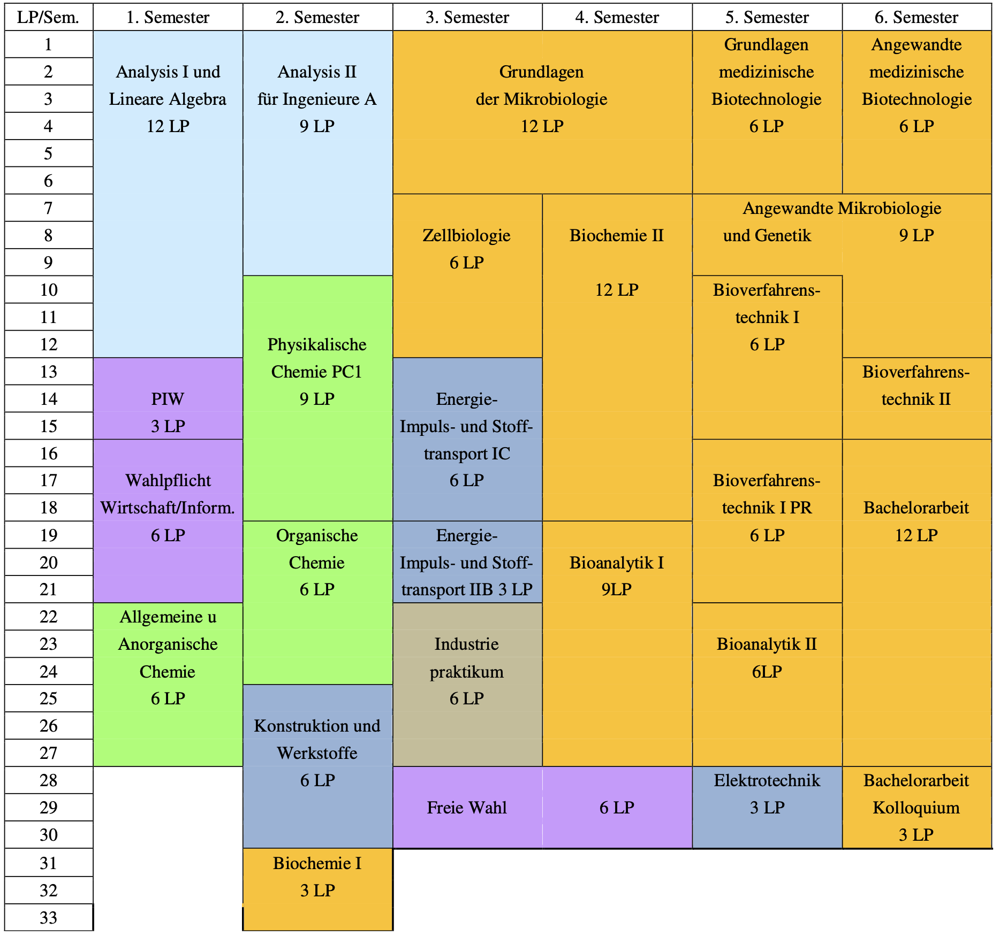

## Общая структура

### Поступление

Оценка варьируется из года в год, но порог не высок. Нужно сдать С1 немецкого, но знания английского пригодятся с первого же семестра. 
С любым вопросом можно обратиться либо письменно к [Kiana Karbasiyan](mailto:studienberatung.bt@fakultaet3.tu-berlin.de), она помогает именно биотехнологам, или встретиться онлайн [via Zoom](https://www.tu.berlin/studierendensekretariat/kontakt-sprechzeiten) immer montags, dienstags und donnerstags zwischen 9:00 - 11:00 Uhr.

### Gruppen 
- в первые дни надо через кого-то добавиться в группу Ersties в WhatsApp, чтобы не упускать важную информацию. Дальше будут создаваться группы на каждый предмет и отправлять туда ссылки. Последующие семестры эта группа тоже помогает. 


Важно! 
- не упускать даты записи на сам предмет, туториумы, экзамены, практику и тд… 
- очень помогает группа студентов в ватсапе, где всегда найдётся знающий! 
- в семестре, когда будешь писать Bachelorarbeit, нельзя оставить только бакалаврскую, надо чтобы быть обязательно ещё какой-то из модулей 
- нельзя оставить практику как модуль (никто не понимает почему, но пока это так. Мы жаловались и, возможно, в твоё время это уже изменят :) ) + посмотри о MedBT 
- можно не идти по тому расписанию, которое предлагается 
- есть много ребят в 9 и 11 семетрах, но не паникуй закончить за 6 семестров, никто не стремится/не пытается 


### Altklausuren:
- спрашивать туторов/других студентов 
- искать на studoco или freitagstunde 

## 1. семестр: 

### AnaLina 
- лекции для желающих, но для сдачи помогают туториумы (надо найти хорошего, можно посещать любую группу. Советую Ашота и Шиву) и старые клаузуры. Лучше учить с кем-то вместе. Домашки сложнее, чем клаузура.
- шпрехштунден помогают и если повезёт, помогут с домашкой (зависит от тутора).

### PIW 
- недельный проект 
- если теряешься в выборе, советую успеть занять место (а их разбирают в первые минуты!) в проекте с Vera Meyer, так как она прекрасный преподаватель и предлагает интересные направления. В будущих семестрах с ней будут лекции. Сама я участвовала в Darmflora и целую неделю мы были в Шарите. Довольна. 
- как проходит: делаешь выбор и уже после нового года вас освободят от одной недели учёбы, в течение который вы будете заниматься только проектом. Один день будете в лаборатории, остальные дни лекции (зависит от проекта). Работаете в группе по двое-трое, рассказываете свою презентацию на 10 минут сперва перед студентами, которые тоже выбрали этот проект, а после соединяете ваши проекты в один и рассказываете (не все, только желающие) перед всеми остальными студентами факультета, кто взял этот предмет. 
Интересный и простой предмет. 

### Wahlpflicht 
- есть два выбора: либо программирование, либо экономика. Первый - труднее. Второй - просто научишься решать задачки и будет немного графиков. Старые клаузуры и домашки спасают.

### Allgemeine und anorganische chemie 
- будет неделя практики, после экзамен 
- онлайн экзамен: совсем просто, если вести конспект :) 
- повторение из школы/штудиенколлега 
- посмотри о Konstruktion und Werkstoffe из второго семестра и MiBi из третьего!

## 2. семестр 

### Analysis 2 (Ana 2)
- проще, чем аналина, если уже немного влился, так как не скачите с одной темы на другую 
- лекции на любителя, помогают туториумы (надо выбрать хорошего, можно в любую группу ходить. Советую Ашота и Шиву) и старые клаузуры 
- есть каждую неделю встречи, где вы разбираете лекцию/домашку и в конце старые клаузуры
- шпрехштунден очень помогают, если найти тутора хорошего

### Physikalische Chemie (PC)
- нужно найти хорошего тутора 
- старых клаузур нет, нужно решать все задачи, которые дают 
- один из немногих завальных предметов 
- большой минус, что этот предмет только летом (лучше не откладывать, тк потом будет трудно с EIS)

### Organische Chemie (OC)
- лектор быстро говорит, но интересно ведёт в начале, в конце становится запутанне. Лучше сразу разбираться со всеми задачами, которые дают на Übungen. 
- практика занимает всю неделю и дома надо будет готовиться каждый день на следующий день, так как надо будет запонять протоколы (или можно продружиться с кем-то, записаться во вторую группу, а потом из первой группы уже использовать ответы и не так стрессовать:)) 
- есть старые клаузуры, так что готовиться надо по ним, но до этого лучше перерешать ещё разок все листы с задачами, которые были в течение семестра. Ответы будут на изисе + шпрехштунден помогают. 
- завальный предмет, больше чем PC, но реальный! Эти два сдать и уже дальше »гигантов« нет :)

### Konstruktion und Werkstoffe 
- будут два лектора и две лекции в неделю. Обе не очень интересно ведутся, не помогают с экзаменом.
- есть старые клаузуры и их достаточно 
- будет две "практики", где надо будет просто смотреть видео и выполнять задачи. Можно с другими студентами сверять и использовать шпрехштунден, которые будут два раза до сдачи задачи. С задачей с графиком лучше использовать возможность и посоветоваться с профессором/тутором. 
- предмет не трудный и некоторые берут его уже в первом семестре!

## 3. семестр

### Grundlagen der Mikrobiologie (MiBi)
- прекрасный профессор Вера Майер вдохновляюще ведёт! Лекции закончатся до нового года. Все будут онлайн и потом можно приходить (советую) на встречу, где обсуждается лекция, задаются вопросы, проводится кахут (надо отвечать вопросы и тот, кто наберёт больше баллов, получит подарок от профессора) и она даёт разную полезуную информацию о биотехнологии. 
- есть практика (10 встреч раз в неделю, где будет один тест (внезапный) и проект на одного) и лучше её делать зимой. Но место надо будет успеть занять! Проходит интересно, без напряга. 
- предмет длится год
- оценка с экзамена будет суммирована с оценкой с практики и письменного эказмена 
- есть старые клаузуры 
- никто никогда не заваливал
- кайфуй! :)

### Zellbiologie 
- зависит от профессора, но мне не повезло. Так что смотрю записи с лекций, которые были в корону (доступ открыт, просто найди этот же модуль уже в неактуальных семестрах на изисе) 
- экзамен устный и надо будет рассказать (по твоему выбору) 6 лекций

### Elektrotechnik 
- посещение не помогает для сдачи 
- есть старые клаузуры + задачи с лекций 

### Industriepraktikum 
- почти никто её не делает в третьем семестре, так как надо сделать 6 недель Grundpraktikum (хоть что сюда входит, можно, например, работать в Реве) и 6 недель на фирме. 
- можно попробовать сделать [практику вне Германии + получить стипендию за это](https://www.tu.berlin/fakultaet3/studium-lehre/studium-praktika-im-ausland)
+ Вера даст список фирм, на которые можно податься в Берлине 

### Freie Wahl 
- многие берут языковые курсы

### Grundlagen medizinische Biotechnologie (MedBT)
- это из пятого семестра, но можно взять, когда захочется - предмет вдохновляющий. 
- большой плюс, что его можно сдать в любой момент! Да-да, хоть через три года! Надо будет только написать письмо профессору и она выдаст тебе термин на устную сдачу. Надо будет выучить 6 лекция, но и по дргуим может задавать вопросы. 
- часто оставляют с бакалаворской работой, так как очень удобно, что сдача в любой момент! 
- все сдают

### Bioverfahrenstechnik (BVT) 
- предмет из пятого семестра, но можно взять уже в третьем 
- будет 9 онлайн домашек (можно найти ответы) 
- два экзамена онлайн! можно делать в группе
- есть пратика, как отдельный модуль (два посещения биореакторов и надо написать протокол на 30 страниц, можно брать эти модули раздельно) 
- домашка + первый экзамен уже дают 60 процентов от общей оценки! 
- все сдают