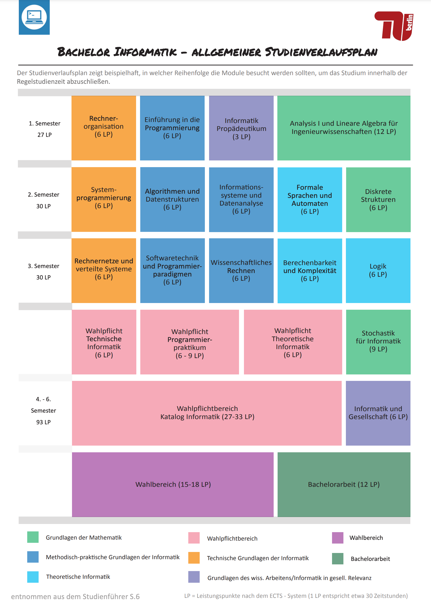

Важная ремарка. Я "везучий" и учиться начал прямо в разгар ковида, в WiSe 20/21. Поэтому первые два семестра я провел полностью в онлайн, третий полу-очно, все остальные ходил в универ. Это важно, потому что формат модуля много чего определяет, но глобально все, что я напишу тут, все еще релевантно. 

**Начну с советов общего характера в порядке уменьшения важности:**


1. Ищите **сразу** шарящих одногруппников и дружите с ним. Это сложно, но возможно. Проще всего на туториумах, наблюдать, кто активные и ненавязчиво знакомиться. Ну или/и дискорд: [этот](https://discord.com/invite/3rRwuzQPpg) и [этот](https://discord.com/invite/amphfEWJQf). Не для того, чтобы они чето за вас делали, а чтобы постоянно собираться и учиться вместе. Чем раньше вы начнете это делать, тем выше шанс успешно закончить. В соло сложно, потому что все равно постоянно групповые домашки.
2. Сдавайте экзы в **первый** термин. Это важно.
3. Лучшая подготовка к экзу - [**клазуры прошлых лет**](https://docs.freitagsrunde.org/Klausuren/).


## Первый взгляд

Есть такая вещь, как план. Он достаточно неплохо составлен, поэтому идти по нему мне представляется логичным. Есть поверье, что план накидали чисто по приколу, потому что 6 семестров "это база", а в среднем челы все равно заканчивают за 12 семестров (реальная статистика). Но не пугаться! Есть инфа, что если делать все умно, то 6 семестров даже не сказки. Если вы еще не читали гайд по тушке, то вам [сюда](https://tuberlin.ru/posts/guide/). Найти инфу про каждый модуль отдельно на [Moses](https://moseskonto.tu-berlin.de/moses/modultransfersystem/bolognamodule/suchen.html?) или в [телеграм боте](https://t.me/modultransfersystembot) (временно лежит, скоро подниму).

Дальше по семестрам. Основная инфа по каждому и предмету и сколько времени лично у меня суммарно занял каждый конкретный модуль.

## 1 семестр

В первом семестре всего 4 предмета. Семестр относительно чиловый.

### 1. InfoProp: Informatik Propädeutikum
Занял 13.5 часов. Супер базовое введение в computer science: история, графы, тьюринг машины и прочее. Время на модуль говорит за себя: ноль усилий и все равно 1.0. Экзамен был чисто вызубрил ли ты теорию, по необязательным домашкам, так что во время экза лучше проделать все.

### 2. ROrg: Rechnerorganisation
Занял 75 часов. Модуль про архитектуру микропроцессоров и ассемблер. Лекции - мой семестр у нас были записанные видео и они были максимально душные. По ощущениям проф просто читал учебник на фоне слайдов и все. Имхо, трата времени. Проще смотреть слайды, ходить на туториумы. На модуле часто возникало ощущение, что ну вообще ничего непонятно, но в конечном итоге как-то разбираешься.

В 2019 году оценка состояла из трех вещей: 20% multiple choice, 20% домашка по ассемблеру (у нас был MIPS) и 60% экзамен. Первый тест почти в самом начале семестра, так что времени разгоняться нет, надо сразу серьезно учиться, чтобы не потерять баллы, тогда тест будет несложный. С домашкой тоже начинать сразу, потому что она объемная: нам надо было запрогать что-то вроде блум-фильтра. Могу сказать точно: если вы сделали и поняли все Übungsblätter, то для домашки этого должно более чем хватить. Очень помогает писать сначала код на си, который ко времени домашки ты уже научился писать на интропроге, и тогда все становится легче. Экз обычный, по всему материалу в течение семестра.

### 3. IntroProg: Einführung in die Programmierung

Занял 78 часов. Введение в прогу на си. Кто-то считает это садизмом, введение да еще и на си, но мне кажется, что это правильно. 

Первые две недели крэш курс по си, дальше чисто алгосы и сортировки, потом добавляются полу-формальные оценки памяти и времени. Лекции кошмар - буквально засыпал на каждой. Профессор все усложняет и плохо объясняет, так что лично я лекции по факту и не смотрел (иронично, ведь потом этот проф был главным на моей работе, ха-ха). Если бы туториумы и лекции поменяли местами, было бы сильно яснее. Домашки очень важно: можно не сдать только одну, иначе не допуск к экзу и пересдача автоматом. Многие не были в курсе и было больно. Домашки разные по уровню сложности, но чаще всего можно (и нужно) сходить на Sprechstunde, там обязательно помогут (кому-то челы просто сниппеты коды кидали в открытую (осуждаем такое)). Результаты тестов дз ты видишь сразу, так что можно не переживать сдал или нет. Зеленая галочка = сдал. Экзамен в мой год - такой же кошмар. Первый опыт с ковидом и онлайном, челы сделали абсолютно неадекватный экзамен и пришлось после того, как они посмотрели статистику, выравнивать Notenschlüssel, чтобы поправить свою ошибку. Но помню я тогда смотрел экзы из Präsenz и они были легчайшие, так что должно быть все ок.

### 4. AnaLina: Analysis I und Lineare Algebra
Занял 119 часов. Название модуля говорит само за себя - матеша. Была два профа, Winkert был классный, смотрел все лекции от него. Есть критерий для допуска к экзу, домашки делаются в группе 3х человек - в целом, ничего сложного, но времязатратно. Без критерия не допущен к эзкамену, так что домашки делать все. К тому же это отличная подготовка к экзамену.

Три лекции в неделю, потому что модуль 12 LP. Сложность их возрастает достаточно быстро и к лекции 48 есть вероятность, что будет сложно понимать. Но это нестрашно: многие не смотрели лекции почти совсем и все равно сдавали норм. Но я смотрел, было полезно Задания лучше делать все: домашки (о них и речи не идет) и задания для Großübung.

## 2 семестр

### 1. AlgoDat: Algorithmen und Datenstrukturen
Занял 109 часов. Вполне себе хайлайт семестра. У меня был Брок, он очень забавный и очень драма-квин, каждый семестр какая-то эпопея с плагиатами. Название модуля говорит за себя, делается на джаве, суммарно 11 домашек. Они боль. В ретроспективе конечно не сказать, что там что-то особенное, но во втором семестре вполне себе охуеваешь и времени занимает очень много. Идея еще такая, что в какой-то момент появляются тесты для домашек на сервере, чтобы проверять свое решение, но доступны они становятся все реже, доходя до одного прогона в неделю. Так что лучше сразу начинать после публикации, чтобы под конец иметь возможность тестить чуть больше. Плюс в том, что страдания окупаются и 50 процентов оценки это и есть эти дз. Это также хороший курс научиться разбираться в вещах более подробно и не спеша: берешь бумажку, ручку и сидишь симулируешь прогоны. Потом очень пригодится. 

Экзамен адекватный, ничего экстраординарного. 

### 2. ISDA: Informationssysteme und Datenanalyse

Занял 30 часов. Легчайший модуль про базы данных, базовый SQL и все такое. Лекции тогдашние от Борусана мне было смотреть тяжело, да и смысла в этом было не так много. Раньше экзамен состоял из мидтерма, домашки и финального экзамена. Домашка с автопроверкой, так что спокойно делается на максимум (в принципе даже хардкодится, но лучше все же выкупить эту базу), все остальное тупо по лекциям и туториумам. 30 часов за весь семестр вполне хватает на 1.0.

### 3. DS: Diskrete Strukturen
Занял 57 часов. Насколько я помню, это боль. Зависит от профа, у которого лекции, сейчас по-моему Кройтцер, который сам по себе супер классный, но объясняет все очень сложно. Модуль опасный и очень легко его не сдать. 

Оценка складывается из мидтерма, объемной домашки и финального экзамена. Мидтерм самый легкий из всех, так что на нем драгоценные пункты терять нельзя. Для домашки надо искать себе самых жестких одногруппников, которых только можно найти, чтобы страдать чуть меньше. Домашку также надо делать в LaTeX, так что неплохо бы до этого иметь хотя бы минимальное представление о том, как техать, потому что иначе времени уходит сильно больше. 

### 4. ForSa: Formale Sprachen und Automaten:
Занял 69 часов. Во-первых, модуль делает Нестманн, которому реально не все равно и который пытается интегрировать все best practiсes, которые только возможно. Во-вторых, это теоретическая информатика, поэтому иногда это не помогает. По началу предмет может сбивать с толку, но главное делать регулярно все туториумы, рано начинать с домашкой, которую тоже надо техать, и не унывать. В мой год была одна большая домашка, потом сделали вроде две маленькие, но суть все та же. Сейчас они вроде еще и групповые, до 2х человек.

Экзамен по моей памяти был очень решаем после всех туториумов и юбунгов. 

*Даниил, WiSe 21/22:* Чиловый модуль, принцип такой, что вникать в материал на 100% не всегда нужно, главное понять смысл заданий, которые дают на туториумах и тд, так как сам модуль достаточно хорошо структурирован, можно нормально все пройти и подготовиться к тестам. По поводу самой лекции, я смотрел только видео, по идее была еще Modukonferenz с кахутом с профессором, на нее я не ходил, но говорят очень полезная тема, формат кахута вообще помогал понимать вещи еще до туториума от части. Первый тест вообще легкий, домашка первая тоже, по сути просто списывание решений из туториумов и лекции вроде, только меняешь релевантные вещи на те что в задании. Главное сохранить все формальности, на них очень сильно обращают внимание. Вторая домашка помню была сложнее, и без хорошей группы сделать ее тяжело, даже если ты и сам шаришь и тд. Второй тест тоже легкий, есть куча тестов прошлых лет, которые выкладывают в самом курсе, поэтому материала для подготовки мегадостаточно. И по нему можно нормально подготовиться, чтобы написать клаузуру на 80%+. Еще совет найти в курсе 22 года туториумы Мишель, там классные записи с них, по которым тоже можно много чего понять. Так же на nlogspace есть 
релевантные видосы по темам.

### 5. SysProg: Systemprogrammierung
Занял 62 часа. Ну все, си нас научили в первом семестре с горем пополам, пора вооружиться им и идти в бой. Модуль про ОС, процессы и всю эту лабуду. В мой семестр было четыре домашки, две текстовые на мало пунктов, две прогерские на много пунктов. Первую я запрогал вплотную к дедлайну, но прокатило. Поэтому сложилось впечатление, что со второй будет так же, но оказалось, что там все гораздо запущенее, так что тут я попал впросак, так что аккуратнее. Первые домашки тоже групповые, хотя работы там точно не на 4 человека.

Экзамен во время написания казался легким, но как пришли результаты оказалось, что нюансов там тоже достаточно, так что тоже предельно аккуратно.  

**К этому моменту учебы начинают появляться новые инсайты:**


1. Сразу искать **норм туторов**, обязательно WiMi, если есть. Ходить на каждый туториум, мозолить им глаза и знакомиться.
2. Тоже самое касается **профа**. Если есть какие-то Q&A стараться очень активно принимать участие, чисто чтобы проф запомнил. Окупится однозначно, когда надо будет писать тезис и думать, че вообще по жизни-то этой делать.
3. После первого сема вполне себе можно устраиваться спокойно на работу **веркштудентом**, но поподаваться придется долго, если нет своих проектов каких-то. Но что-то обязательно найдется. Если работа будет не хоум-офис халтура, то совмещать будет сложно с 30LP. Но нет ничего невозможного!
4. Чтобы облегчить третий пункт, сделать **пет-проект** на каникулах и залить на гитхаб, при этом нормально оформив его презентацию.


## 3 семестр

Общее впечатление от семестра, что он гораздо более сбалансирован относительно других, нет предметов, где можно практически ничего не делать.

### 1. RN: Rechnernetze und verteilte Systeme
Занял 56 часов. Модуль про сети, протоколы и вот это вот все. Раньше модуль считался одним из самых сложных из-за домашек —тогда они были критерием допуска к экзамену и нельзя было не сдавать их. В моем семестре ребята решили поэкспериментировать и изменили формат, теперь домашки были 10% от оценки. Естественно, их никто не делал. Соотношение пунктов и эффорта абсолютно не оправдывало себя, потому что чтобы тогда сделать все домашки надо уверенно умножать потраченное на модуль время на три. Сейчас все немного изменилось: домашки весят 30%, что уже существенно, и их изменили, теперь они не такие жесткие. Так что должно быть выполнимо. Экз обычный, без приколов.

### 2. BeKo: Berechenbarkeit und Komplexität
Занял 64 часа. Вычислимость, сложность, редукции, ну и дальше по списку. Вообще классный и интересный модуль, но в каких-то местах может казаться не самым интуитивно-понятным и тривиальным. Не знаю, как там сейчас с лекциями, но если они говно, то всегда можно энролнуться в курс 21/22 года и смотреть видосы, они отличные. Как всегда, на туторуимы ходить очень рекомендую, в идеале к вими. Экз нелегкий со всякими доказательствами, как и домашка, так что закладывайте сил и нервов.

### 3. SWTPP: Softwaretechnik und Programmierparadigmen
Занял 64 часа. Достаточно душный модуль, который ВРОДЕ КАК про то, как вообще писать код, а по факту вообще не про это. Духота с UML диаграммами, не очень большой фокус на парадигмы как таковые, к сожалению. В целом, экз норм, если все лекции проработать, домашка достаточно объемная.

В мой семестр надо было написать логику китайских шахмат и запрогать бота на хаскеле, который против тебя будет играть. На часть на хаскелле у нас вообще времени не хватило, а жалко, челы потом турнир ботов устраивали.

### 4. WiRe: Wissenschaftliches Rechnen
Занял 75 часов. Своеобразное продолжение линала и анализа, только еще и привязкой к реальному миру. Домашки на питоне очень интересные, но думаю они занимают большую часть всего времени, зато идут сразу в оценку. В моей семестр был один неадекватный экзамен онлайн, и супер изичный экзамен в жизни, так что думаю, что сейчас тоже должно быть все адекватно. Лекции сумбурные, я не смотрел. Вообще, гениальный мув это сделать аналину в Early Bird еще до учебы, а WiRe в первом семестре, жалко, что я такой опции не знал :(

### 5. Logik
Занял 87 часов. Проклинают и ненавидят, но в целом норм модуль. Ходить на все туторуимы, опять только к вими, на все Großübung и будет все тип-топ (то есть будет сдано). Лекции тяжелопереваримы, насколько я помню, но я могу плохо помнить, дело было давно. Наверное самая неприятная часть — две большие и сложные домашки, здесь только искать норм тиммейтов.

После этого семестра уже начинается Spaß, но только на полшишечки: можно будет выбирать, но не из шибко большого выбора. А вот в пятом семестре...