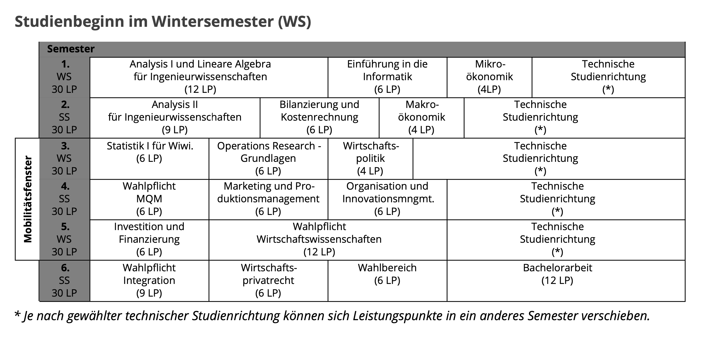

## Вступление

Приветствую, дорогие друзья! 

Сегодня я вам расскажу об одном интересном бакалавре - **Wirtschaftsingenieurwesen** (WiIng). На русский я перевожу как "инженер-экономист", а наш универ предводит на английский как "Industrial Engineering and Management" (я хз как они это так перевели, но звучит круче).

Давайте сначала вкратце о самом штудиенганге! 
Представьте себе, что экономика и какой-то раздел инженерии (в моем случае software engineering) поженились, и у них появился ребёнок, у которого 70% генов от папы и 70% от мамы. Да, понимаю, математика не складывается, но, к сожалению, это так. В наше направление впихнули все, что можно было… Мы делаем те же модули, которые все делают, но получаем меньше LP, или делаем углублённые модули, не пройдя базовые курсы. 
Но все не так уж и плохо! Если у тебя широкий кругозор, любишь физику и математику, нет хобби и мечтаешь много о деньгах, то тебе к нам, мой милый друг! 

Меня довольно часто спрашивают, что с этим направлением можно делать. Я раньше отвечал, что почти всем можно заниматься (папа так сказал, я сам хз, был тупым). Но теперь-то я уверен, что это и вправду так! У меня куча знакомых, которые учились/учатся на WiIng, и работают они везде: в IT, Audit, консалтинг, медицинских учреждениях, агентствах, автомобильной индустрии, банках. Я сам работал два года в маркетинговой агентуре в отделах Business Intelligence и маркетинг. Теперь я работаю в банке в отделе, который валидирует все математические модели (хз как я сюда попал, пиздец сложно). 
Как видите, все пути открыты! Благодаря тому ментальному насилию, через который вы пройдёте в WiIng, вам ничего не страшно и все у вас получится! 

А ещё я должен упомянуть, как я вам очень завидую. 
Универ - это не только знания, но и новые крутые друзья, приятели и приключения. Но, к сожалению, я такой же "везучий" как и Денис - учеба началась у меня во время короны… Так что в начале было довольно сложно в социальной сфере. 
Но вам очень повезло с этим коммьюнити! Тут у нас очень активная группа, где всегда поддержат и советы дельные дадут. А также тут много классных и интересных ребят 😉

Так что все пейте пиво за здоровье Дениса! 🍻

## Рекомендации общего характера


- Найдите мотивированных людей для групповых работ или домашек. Одному всегда можно, но зачем усложнять себе жизнь? В начале семестра изучаешь, кто сидит на первой парте и задаёт куча вопросов преподу, а потом ты идёшь знакомиться! 
- Лучшая подготовка к экзаменам это алтклаузуры (прошлогодные экзамены)
- Я предпочитаю делить свои экзамены на первый и второй термин. Так у меня больше времени для подготовки. (этот совет не сработает, если вы решитесь вернуться день до экзамена с отпуска)
- Вступите в инициативы! В ТУ куча классных студенческих объединений для всех типов людей: от карьеристов до алкашей. Я сам активно хожу на мероприятия Berliner Börsenkreis. Тем, кто любит деньги и финансовые темы, очень понравятся 😏😉 


## Структура

Теперь мы поговорим о том, что вас именно ждёт в этом бакалавре. 

Ответы на все ваши вопросы об организации штудиенганга можно также найти конечно же в [StuPo](https://www.static.tu.berlin/fileadmin/www/10000000/Studiengaenge/StuPOs/Fakultaet_VII/Wirtschaftsingenieurwesen_B.Sc._2015.pdf)! Это документ, в котором есть вся важная информация, так что советую просмотреть все! 

## Studienrichtung (Vertiefung)

Для начала вам стоит задуматься, какое инженерное углубление (Vertiefung) вас больше всего интересует. 
На выбор у вас: 
- Bauingenieurwesen
- Chemie und Verfahrenstechnik
- Elektrotechnik
- Energie und Ressourcen
- Informations- und Kommunikationssysteme
- Maschinenbau
- Verkehrswesen

Направления все очень интересные, самыми популярными являются Energie und Ressourcen и Maschinenbau. Я сам выбрал Informations- und Kommunikationssysteme (IuK) - довольно длинное название, но это на самом деле просто информатика. 
Углубление можно выбирать даже чуть позже, но не стоит долго тянуть. Менять Vertiefung можно, но нужно учесть, что некоторые модули, которые вы сделали для другого углубления, вам тогда не засчитают.
Выбранное вами углубление сказывается на том, какие модули вам надо делать. А также ещё влияет, какую практику надо делать. 

## Практика

Да, к сожалению, практика обязательная. Нужно пройти её, чтоб получить доступ писать бакалаврскую работу. Находишь себе место сам и как минимум на 9 недель, полная ставка. Это довольно занудно, так как там есть обязательные критерии для практики в зависимости от выбранного углубления. Также тебе нужно написать **Wochenbericht** и **Praktikumsbericht**. 

Wochenbericht, к сожалению, обязательный, нужно описывать, что именно ты делал каждый день. Praktikumsbericht (сочинение на пару страниц) можно не делать, если в твоём Praktikumszeugnis (документ, который тебе даёт работодатель) написано, что ты молодец и что провели разъяснительную беседу о проделанной работе. 

Если вы уже работаете где-то, то можно попробовать засчитать это как свою практику. 

## Модули

Перейдём к нашим любимым предметам!
Бывают три категории модулей: 

1. Integrationsbereich
2. Wirtschaftswissenschaften
3. Ingenieurbereich (ваше углубление)

В каждой категории есть модули **Pflicht** (обязательные) и **Wahlpflicht** (выбираешь из определённого каталога). 
Я вам расскажу о своих успехов в обязательных модулях. 

Вот вам Verlaufsplan: 

Универ вам советует так делать модули. Безусловно вы можно делать все, как хотите. Я вам рекомендую первый семестр делать как раз по этому плану, так как все эти предметы самые базовые, и последующие модули будут опираться на них. Анализ 2 и статистику советую делать во втором семестре, а остальные уже по усмотрению. 

А теперь посмотрим на модули. Я, к сожалению, не могу как Денис так подробно описать все модули, но постараюсь вкратце передать суть. 

Уровни сложности бывают: изи, стараться надо, пиздец. 

### АнаЛина (12 LP) и Ана2 (9 LP) 
Математика - это святой предмет. Рекомендую тщательно учить, так как последующая математика будет отсюда. Выбор у вас между Винкертом и Пенн-Карас. И все говорят, что оба классные. Сходите на обе лекции и выберите себе, кто вам больше по душе. Я ходил к Пенн-Карас, она очень милая бабушка и очень хорошо объясняет. Вот только почерк мелкий, а в остальном все отлично.  

Предмет сам довольно трудный и занимает много времени. Три лекции, Übung, туторуим и обязательная домашка (иначе вас не пустят на экзамен) в АнаЛина. В Ана2 уже чуть легче: две лекции и туторуим. 

*Сложность: пиздец*

### Einführung in die Informatik (6 LP)
В начале покажут, как работает компуктер, потом будете программировать. В зависимости от углубления выбираем язык программирования (Java или C). В основном учат базовые алгоритмы как искать или сортировать. Довольно интересный модуль. 

*Сложность: между стараться надо и пиздец*

### Mikroökonomie (4 LP)
Матеша очень лёгкая. Даже школьник справится - ищи производную и все. Ваш препод Ivanova Stenzel и у неё ужасный акцент. Так что вряд ли что-то поймёте на лекции. Попытайте удачу на туториумах. Модуль про самые скучные базовые темы экономики.

*Сложность: стараться надо* 

### Makroökonmie (4 LP)
Можно делать только после микроэкономики. Темы похожи, только теперь на государственном уровне. Матеша та же, но больше графиков 

*Сложность: стараться надо*

### Wirtschaftspolitik (4 LP)
Тоже можно делать только после микроэкономики. Ещё больше скучной теории. Рассказывают про разные экономические школы. 

*Сложность: стараться надо*


Последние три предмета по объёму вообще 6 LP, но нашему штудиенгангу засчитывают только по 4 LP 🙃
А также многим даётся очень сложно интерпретация описанных идей в этих трех модулях, так как все объясняется на очень абстрактном теоретическом уровне. Но в интернете куча классных видосиков, которые вам помогут! 


### Статистика 1 (6 LP)
Классный предмет, учит базовые навыки для работы с данными. Видосики с визуализацией очень помогут! 

*Сложность: пиздец* 

### Bilanzierung und Kostenrechnung (6 LP)
Базовая бухгалтерия. В начале довольно сложно вникнуть. Но, решая задачки, вы все поймёте без проблем интуитивно! 

*Сложность: между изи и стараться надо*

### Operation Reserach (6 LP)
Решаем задачи с помощью алгоритмов. Если усердно учитсья в туториумах, не надо даже на лекцию ходить.

*Сложность: между изи и стараться надо*

### Marketing und Produktionsmanagement (6 LP)
Зубрим слайды маркетинга, а для Продуктион решаем задачки (очень похожи на Operation Reserach).

*Сложность: между изи и стараться надо*

### Organisation- und Innovationsmanagement (6 LP)
Зубрим все слайды для экзамена. Довольно интересный модуль. Рассказывают, какой стиль организации оптимальный для определённых целей и что надо всегда быть innovative 💡

*Сложность: изи* 

### Wirtschaftsprivatrecht (6 LP)
Очень интересный предмет, научат базу право в Германии. Туторуимы классные, проф очень добрый (но любит болтать много). Обычно экзамен сдают на 1.0 или несдача. Среднее редко бывает…

*Сложность: пиздец* 

### Investition und Finanzierung (6 LP)
Тут вы погружаетесь в мир финансов. Сдача экзамена не гарантирует, что вы станете богатым, но сможете понимать, что пишут в финансовых новостях и притворяться умным.

*Сложность: между стараться надо и пиздец*

## Бакалавр (12 LP)
В зависимости от препода и темы это может быть сущим адом или интересным проектом для вас. Начинайте искать себе классного препода за семестр до того, как вы хотите написать работу. Желательно выберите тему сами и что-то, что вас очень интересует, иначе писать работу для вас будет тяжёлым испытанием. 

Вышеперечисленная характеристика и уровни сложности являются субъективной оценкой. 

